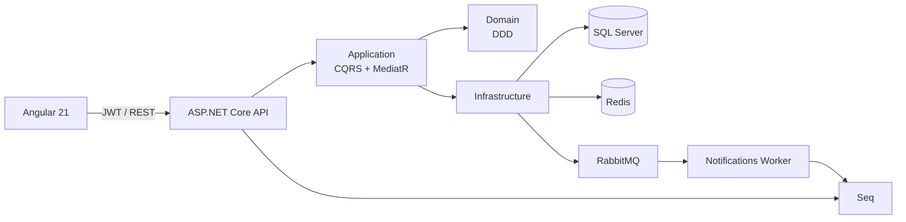

# ClinicHub

Plataforma full stack de gestão de pacientes, consultas e financeiro para clínicas médicas. O projeto é um laboratório de arquitetura e práticas de engenharia: .NET 8, Angular standalone, Clean Architecture, mensageria, cache distribuído, observabilidade e CI/CD.

[](https://github.com/eliasmatheusouza/ClinicHub/actions/workflows/ci.yml)

## Arquitetura



As camadas internas não dependem de HTTP, banco ou mensageria. Veja o desenho detalhado e os fluxos em [docs/arquitetura.md](docs/arquitetura.md).

## Stack

| Área | Tecnologias |
|---|---|
| Backend | .NET 8, ASP.NET Core, EF Core, Dapper, MediatR, FluentValidation |
| Dados e integração | SQL Server, Redis, RabbitMQ |
| Frontend | Angular 21 standalone, TypeScript, Angular Material |
| Observabilidade | Serilog, Seq, Correlation ID e health checks |
| Entrega | Docker Compose, GitHub Actions |

## Início rápido

Pré-requisitos: Docker Desktop com Linux containers e Docker Compose.

```powershell
Copy-Item .env.example .env
docker compose up -d --build
docker compose ps
```

| Serviço | Endereço |
|---|---|
| Aplicação Angular | http://localhost:4200 |
| API | http://localhost:8082 |
| Swagger / OpenAPI | http://localhost:8082/swagger |
| Seq | http://localhost:8081 |
| RabbitMQ Management | http://localhost:15672 |

O Compose aplica migrations e cria os usuários de desenvolvimento uma única vez.

| Perfil | E-mail | Senha |
|---|---|---|
| Admin | `admin@clinichub.local` | `Admin123!` |
| Doctor | `doctor@clinichub.local` | `Doctor123!` |

As credenciais são exclusivamente locais e podem ser alteradas no `.env`. Informações de portas, logs, health checks, reset de infraestrutura e SMTP estão em [docs/operacao-local.md](docs/operacao-local.md).

## Módulos

- **Autenticação:** JWT de curta duração, refresh token rotativo e autorização por role.
- **Cadastro público:** rota `/register`, confirmação por e-mail e ativação de conta `Patient` por token de uso único.
- **Portal do paciente (API):** criação e manutenção do próprio perfil com vínculo único por conta e rotas seguras `/me`.
- **Pacientes:** CRUD, filtros, paginação e cache Redis versionado.
- **Agenda:** criar, confirmar, reagendar e cancelar; conflitos de horários são regras de domínio.
- **Notificações:** confirmação de consulta publica evento no RabbitMQ; worker consome a fila durável.
- **Financeiro:** pagamento por consulta confirmada e relatório de receita por período usando Dapper.

## Desenvolvimento sem Docker

Backend:

```powershell
dotnet restore ClinicHub.sln
dotnet run --project src/ClinicHub.API
```

Frontend:

```powershell
Set-Location frontend/clinichub-web
npm ci
npm start
```

Para executar localmente fora do Compose, ajuste as connection strings de `appsettings.Development.json` para serviços disponíveis. O padrão do projeto usa Redis em `localhost:6380` e API publicada em `localhost:8082`, evitando conflito com outros projetos locais.

## API e autenticação

Todos os contratos estão disponíveis no Swagger. Há exemplos de payload diretamente na interface para login, cadastro, pacientes, consultas e pagamentos.

```http
POST /api/auth/login
Content-Type: application/json

{ "email": "admin@clinichub.local", "password": "Admin123!" }
```

Envie o `accessToken` recebido como `Authorization: Bearer {token}`. Para exemplos completos, roles e respostas de erro, consulte [docs/api-examples.md](docs/api-examples.md).

### Confirmação de e-mail

Novas contas públicas ficam inativas até a confirmação. No desenvolvimento, `EMAIL_DELIVERY_MODE=Log` escreve o link no log da API. Para SMTP real, altere para `Smtp` e configure as variáveis `EMAIL_*` presentes no `.env.example`. O token bruto não é persistido; somente seu hash SHA-256, por até 24 horas.

## Qualidade

```powershell
dotnet format ClinicHub.sln --verify-no-changes --no-restore
dotnet test ClinicHub.sln --configuration Release --no-restore --collect "XPlat Code Coverage"

Set-Location frontend/clinichub-web
npm run lint
npm run build
npm test -- --watch=false
```

A suíte atual contém 42 testes. Após os testes de cadastro e confirmação de e-mail da etapa 14, a cobertura aferida é de 74,57% no Domain e 74,76% na Application. A próxima etapa torna essa meta um gate obrigatório da CI.

## CI/CD

O workflow [CI](.github/workflows/ci.yml) é executado em todo push, pull request e disparo manual. Ele valida formatação, build Release, testes, cobertura e relatórios TRX .NET; análise TypeScript, build e testes Angular; auditoria de dependências e imagens Docker. O workflow [CodeQL](.github/workflows/codeql.yml) analisa C# e JavaScript/TypeScript; o Dependabot acompanha NuGet, NPM e Actions semanalmente, com alertas e atualizações de segurança habilitados. A execução remota validada mais recente foi aprovada: [CI](https://github.com/eliasmatheusouza/ClinicHub/actions/runs/31452721365) e [CodeQL](https://github.com/eliasmatheusouza/ClinicHub/actions/runs/31452721355).

## Próximas evoluções

O escopo original foi concluído. A evolução recomendada para transformar o projeto em uma aplicação pronta para uso segue esta ordem:

1. **Qualidade e segurança:** tornar a meta de cobertura de 70% obrigatória na CI, corrigir dependências vulneráveis, aplicar rate limiting, HTTPS e gestão de secrets.
2. **Resiliência:** adicionar retry de conexão, DLQ e observabilidade para o worker RabbitMQ; criar reenvio de confirmação de e-mail para contas pendentes.
3. **Produção:** tornar a URL da API configurável em runtime, publicar imagens em registry e implantar frontend, API e infraestrutura em ambiente público.
4. **Gestão de equipe:** permitir que administradores criem e gerenciem médicos e recepcionistas com fluxo seguro de convite.
5. **Portal do paciente:** permitir consultar, cancelar e reagendar as próprias consultas sem acesso às áreas administrativas.
6. **Notificações reais e produto:** integrar SMTP/serviço de e-mail, SMS ou WhatsApp; adicionar dashboard com métricas e disponibilidade médica.

## Documentação

- [Plano de execução e evidências](docs/plano-de-execucao.md)
- [Arquitetura e fluxos](docs/arquitetura.md)
- [Modelo de domínio](docs/modelo-do-dominio.md)
- [Operação local](docs/operacao-local.md)
- [Guia da API](docs/api-examples.md)
- [Guia de estudo passo a passo](docs/guia-de-estudo.md)
- [Plano de ensino completo por módulos](docs/plano-de-ensino-completo.md)
- [Avaliação de maturidade arquitetural](docs/avaliacao-de-maturidade.md)
- [Plano do ecossistema de portfólio](docs/plano-ecossistema-portfolio.md)
- [Trilha de qualidade e Platform Engineering](docs/plano-de-execucao.md#trilha-de-qualidade-e-platform-engineering)
- [AWS para aprendizado gratuito e seguro](docs/aws-aprendizado-gratuito.md)
- [Capacidade, performance e critérios de carga](docs/capacidade-e-performance.md)
- [Auditoria, autorização e evolução do ownership](docs/auditoria-e-autorizacao.md)
- [Proteção de dados, masking e plano de criptografia](docs/protecao-de-dados.md)
- [Hardening de deploy, secrets e DAST](docs/hardening-deploy.md)
- [Architecture Decision Records](docs/adr)

## Estrutura do repositório

```text
src/
  ClinicHub.Domain/                  # Agregados, VOs, eventos e contratos
  ClinicHub.Application/             # CQRS, handlers, DTOs e validações
  ClinicHub.Infrastructure/          # EF Core, Redis, RabbitMQ, Dapper e segurança
  ClinicHub.API/                     # REST, Swagger, middleware e health checks
  ClinicHub.Notifications.Worker/    # Consumidor RabbitMQ
frontend/clinichub-web/              # SPA Angular standalone
tests/                                # Testes de domínio, aplicação, infraestrutura e API
docs/                                 # Arquitetura, operação, API e ADRs
```
