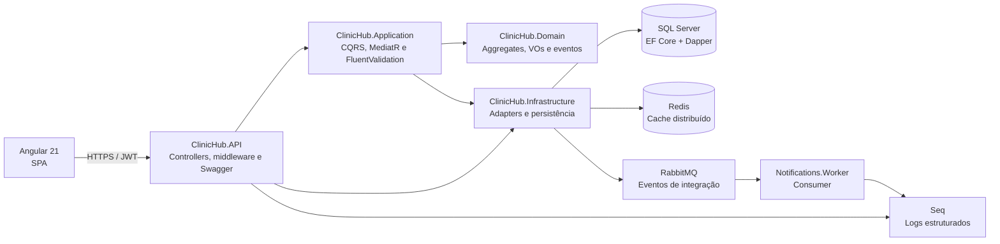
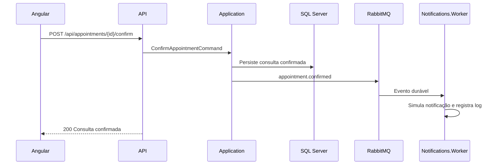

# Arquitetura do ClinicHub

O ClinicHub adota Clean Architecture. As dependências apontam para dentro: regras de domínio não dependem de banco, HTTP, mensageria ou interface.

## Limites das camadas

| Camada | Responsabilidade | Não depende de |
|---|---|---|
| `Domain` | Regras, agregados, value objects, eventos e contratos | Frameworks e infraestrutura |
| `Application` | Casos de uso, CQRS, DTOs e validações | API, EF Core, Redis e RabbitMQ |
| `Infrastructure` | EF Core, Dapper, Redis, JWT, SMTP e RabbitMQ | API e Angular |
| `API` | HTTP, composição de dependências, autenticação e observabilidade | Regras de negócio concretas |
| `Notifications.Worker` | Consumo assíncrono da fila de notificações | Interface web |

## Fluxo de confirmação de consulta

## Segurança e acesso

- Access token JWT curto e refresh token rotativo, persistido somente como hash SHA-256.
- `Admin`, `Doctor` e `Receptionist` atendem aos casos de uso internos conforme as policies dos controllers.
- O cadastro público recebe `Patient`, só é ativado por confirmação de e-mail e não concede permissões administrativas.
- O token de confirmação de e-mail é aleatório, tem validade de 24 horas, é usado uma única vez e é persistido exclusivamente como hash.
- CORS permite a origem do frontend local (`http://localhost:4200`); em implantação, a origem deve ser explicitamente ajustada.
