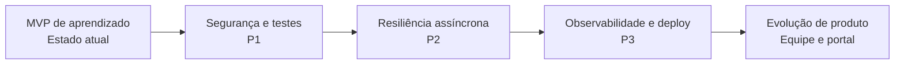

# Avaliação de Maturidade Arquitetural — ClinicHub

> **Objetivo:** registrar de forma honesta o nível atual do ClinicHub, o que ele demonstra como projeto de estudo e o que ainda é necessário antes de chamá-lo de aplicação pronta para produção.

## Veredito

O ClinicHub é um **MVP profissional de aprendizado**. Ele aplica práticas relevantes e atuais sem introduzir complexidade desnecessária: é um monólito modular com Clean Architecture, DDD tático, CQRS pragmático, cache, mensageria, autenticação, observabilidade básica e integração contínua.

Ele **não é, ainda, uma aplicação pronta para produção crítica**. Essa distinção é saudável: padrões arquiteturais não substituem segurança operacional, resiliência, governança de dados e operação contínua.

## O que já está bem construído

| Tema | Situação no projeto | Por que importa |
|---|---|---|
| Arquitetura | Clean Architecture com dependências apontando para o domínio | Mantém regra de negócio independente de HTTP, banco e mensageria. |
| DDD tático | Agregados, value objects, invariantes, eventos de domínio e repositórios | Expressa regras importantes no código e evita o modelo anêmico. |
| Casos de uso | CQRS com MediatR, FluentValidation e handlers | Separa intenção, validação e coordenação do fluxo de aplicação. |
| Dados | EF Core para escrita e Dapper para relatório | Usa cada ferramenta na responsabilidade em que é mais adequada. |
| Segurança inicial | JWT, refresh token rotativo, roles e confirmação de e-mail com token armazenado como hash | Oferece autenticação e autorização consistentes para o escopo do MVP. |
| Integração | Evento de consulta confirmada, RabbitMQ e worker independente | Mostra desacoplamento assíncrono e processamento fora da requisição HTTP. |
| Operação local | Docker Compose, health checks, Serilog, Seq e Correlation ID | Torna o comportamento do sistema observável e reproduzível localmente. |
| Entrega | GitHub Actions, formatação, build, testes e imagens Docker | Evita que alterações básicas quebrem a aplicação sem detecção. |

## DDD: o que significa neste projeto

O projeto implementa bem o **DDD tático**: `Patient`, `Appointment`, `Payment` e `User` encapsulam estado e regras; value objects como `Money` e `AppointmentSlot` protegem invariantes; e o evento de confirmação de consulta representa um fato do domínio.

Isso não equivale, por si só, a DDD completo. O **DDD estratégico** precisa de trabalho de produto contínuo: conversas com especialistas de clínica, linguagem ubíqua validada, mapeamento de contextos delimitados e contratos explícitos entre eles. Para o atual monólito modular, os módulos Pacientes, Agenda, Financeiro e Identidade são uma boa base para essa evolução — sem motivo para separá-los em microserviços agora.

## Lacunas para produção

### Prioridade 1 — segurança, configuração e qualidade

1. **Segredos e ambientes:** remover credenciais/chaves de configurações versionadas; usar variáveis seguras e um cofre de secrets; separar desenvolvimento, homologação e produção.
2. **Proteção HTTP:** habilitar HTTPS e HSTS em produção e aplicar rate limiting, sobretudo em login, cadastro, confirmação e refresh.
3. **Sessão do navegador:** avaliar refresh token em cookie `HttpOnly`, `Secure` e com política `SameSite`, reduzindo exposição a XSS. O token em `localStorage` é adequado para o laboratório, mas é uma decisão que exige cuidado em produção.
4. **Auditoria:** registrar ator, data, antes/depois e Correlation ID para alterações de pacientes, consultas, pagamentos e papéis.
5. **Testes:** manter a meta de 70% em Domain e Application e torná-la obrigatória na CI. A etapa 14 adicionou testes aos fluxos de registro/confirmação e elevou a medição atual para 74,57% no Domain e 74,76% na Application; o próximo risco é permitir nova regressão sem um gate automático.
6. **Dependências:** automatizar auditoria de pacotes .NET/NPM e corrigir vulnerabilidades encontradas, inclusive em dependências de desenvolvimento quando afetarem a cadeia de entrega.

### Prioridade 2 — confiabilidade assíncrona

1. Implementar reconexão e retry com backoff para o worker RabbitMQ.
2. Criar uma dead-letter queue (DLQ), monitoramento e processo seguro de reprocessamento.
3. Adotar **Outbox Pattern** para persistir a mudança de estado e a intenção de publicar o evento na mesma transação de banco.
4. Tornar os consumidores idempotentes para suportar reentrega sem gerar notificações duplicadas.
5. Criar reenvio de confirmação de e-mail para contas pendentes, com limite de tentativas e expiração clara.

### Prioridade 3 — observabilidade, deploy e experiência

1. Instrumentar API e worker com OpenTelemetry para traces, métricas e logs correlacionados; exportar para um collector/APM.
2. Configurar URL da API em runtime no frontend, para promover a mesma imagem Angular entre ambientes.
3. Criar imagens de produção não-root, limites de recursos, política de reinício, backup/restauração testada e migrations controladas no deploy.
4. Incluir guardas de rota por role no Angular para melhorar a experiência do usuário. A autorização decisiva permanece sempre no backend.
5. Acrescentar testes E2E, testes de contrato da API e testes de integração com serviços reais em containers.

## O que não adicionar apenas por moda

Não é recomendável quebrar o ClinicHub em microserviços, adotar event sourcing ou inserir um API Gateway somente para “ficar moderno”. Cada um traz custo operacional real. O desenho atual de monólito modular é a escolha correta enquanto os módulos compartilham ciclo de entrega, equipe e banco de dados.

Um componente deve ser extraído quando houver razão mensurável, por exemplo: escalabilidade independente, equipe com autonomia real, disponibilidade distinta ou fronteiras de domínio estáveis.

## Roteiro de maturidade

| Fase | Resultado esperado |
|---|---|
| Segurança e testes | Aplicação protegida contra abusos comuns, segredos fora do código e qualidade mensurável na CI. |
| Resiliência assíncrona | Falhas transitórias e mensagens problemáticas não se perdem silenciosamente. |
| Observabilidade e deploy | Diagnóstico por traces/métricas, implantação previsível e operação recuperável. |
| Produto | Gestão de equipe, portal do paciente e notificações reais evoluem sobre uma base segura. |

## Referências externas

- [Microsoft — Clean Architecture em aplicações .NET](https://learn.microsoft.com/en-us/dotnet/architecture/modern-web-apps-azure/common-web-application-architectures)
- [Microsoft — DDD, repositórios e CQRS/Dapper](https://learn.microsoft.com/en-us/dotnet/architecture/microservices/microservice-ddd-cqrs-patterns/infrastructure-persistence-layer-design)
- [OWASP API Security Top 10 (2023)](https://owasp.org/API-Security/editions/2023/en/0x10-api-security-risks/)
- [Angular — Route guards](https://angular.dev/guide/routing/route-guards)
- [Microsoft — Observabilidade .NET com OpenTelemetry](https://learn.microsoft.com/en-us/dotnet/core/diagnostics/observability-with-otel)

## Conclusão

O valor principal do ClinicHub é demonstrar decisões que aparecem em software real e permitir que cada uma seja estudada no código. A evolução recomendada não é adicionar mais siglas: é concluir os controles que fazem uma boa arquitetura continuar segura e confiável sob uso real.
