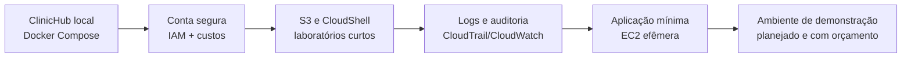

# AWS para Aprendizado — Guia Seguro e de Baixo Custo

> **Objetivo:** aprender os fundamentos de AWS usando o ClinicHub como referência, sem tratar a nuvem como “gratuita para sempre” e sem publicar dados reais de saúde.

## Antes de começar: “Free Tier” não significa custo impossível

AWS exige forma de pagamento e pode cobrar quando um limite, crédito ou período de gratuidade termina. Para contas criadas após 15/07/2025, o plano de conta gratuita tem regras próprias: os créditos e o plano terminam após seis meses ou quando os créditos se esgotam; o plano pago passa a cobrar o consumo que exceder a cobertura aplicável. Os limites e elegibilidade mudam, portanto a fonte de verdade é sempre a página da conta e a [documentação do AWS Free Tier](https://docs.aws.amazon.com/awsaccountbilling/latest/aboutv2/free-tier.html).

Este guia reduz risco de custo; ele **não é uma garantia de custo zero**. Não use recursos que você não entende, e remova recursos de laboratório imediatamente após o exercício.

## Resultado de aprendizagem

Ao concluir os laboratórios, você saberá:

- proteger uma conta AWS e usar credenciais temporárias;
- acompanhar consumo, orçamento e anomalias;
- usar AWS CLI sem instalar nada localmente;
- trabalhar com IAM, S3, CloudWatch e CloudTrail em um cenário controlado;
- entender por que o Compose completo do ClinicHub não cabe em uma instância gratuita pequena;
- preparar uma futura implantação com rede, secrets e observabilidade adequados.

## Regras do laboratório

1. Use apenas dados sintéticos: nunca envie pacientes, e-mails reais, documentos médicos ou credenciais para a conta de estudo.
2. Escolha **uma região** para os primeiros exercícios e permaneça nela. Regiões diferentes multiplicam recursos esquecidos.
3. Aplique as tags `Project=ClinicHub`, `Environment=learning` e `Owner=Matheus` a todo recurso que permitir tags.
4. Antes de criar qualquer recurso, descubra como encerrá-lo e quais artefatos permanecem após exclusão, como volumes, snapshots, IPs e logs.
5. Não habilite serviços de IA, bancos gerenciados, NAT Gateway, load balancers, WAF, suporte pago ou Marketplace sem ler antes a página de preço.

## Fase 0 — Conta segura e controle de custos

Faça esta fase antes de criar qualquer recurso.

### 0.1 Criar e proteger a conta

1. Crie a conta em [AWS Free Tier](https://aws.amazon.com/free/).
2. Ative MFA no usuário root com aplicativo autenticador ou chave de segurança.
3. Não crie access keys para o root e não use o root no dia a dia.
4. Crie um usuário administrativo no IAM Identity Center ou uma identidade administrativa com o menor privilégio necessário para o laboratório.
5. Prefira credenciais temporárias/roles a chaves de acesso de longa duração.

A AWS recomenda explicitamente MFA para root, não criar access keys para root e criar uma identidade administrativa separada para tarefas diárias. [Boas práticas para root](https://docs.aws.amazon.com/IAM/latest/UserGuide/root-user-best-practices.html) · [Boas práticas IAM](https://docs.aws.amazon.com/IAM/latest/UserGuide/best-practices.html)

### 0.2 Configurar alarmes de custo

No console AWS, em **Billing and Cost Management**:

1. Em **Billing preferences**, confirme o e-mail e habilite alertas do Free Tier.
2. Em **Budgets**, crie um orçamento mensal pequeno em USD (por exemplo, US$ 1) com alertas de custo real em 50%, 80% e 100%.
3. Adicione alerta de custo previsto em 100%.
4. Em **Cost Anomaly Detection**, crie um monitor de serviços AWS com alerta por e-mail.
5. Verifique semanalmente a página **Free Tier**, Cost Explorer e a fatura.

Alertas não desligam recursos automaticamente e os dados de custo podem atrasar. Eles são um aviso para você investigar e excluir o recurso responsável. A AWS documenta alertas de uso do Free Tier e o monitoramento de anomalias separadamente. [Free Tier usage alerts](https://docs.aws.amazon.com/awsaccountbilling/latest/aboutv2/tracking-free-tier-usage.html) · [Cost Anomaly Detection](https://docs.aws.amazon.com/cost-management/latest/userguide/getting-started-ad.html)

### Checklist de saída

- [ ] MFA do root ativado.
- [ ] Nenhuma access key do root existe.
- [ ] Identidade administrativa diária criada.
- [ ] Alertas Free Tier, Budget e anomalia configurados.
- [ ] Uma região de aprendizado definida.

## Fase 1 — AWS CLI e identidade sem custo adicional

Use o **AWS CloudShell** pelo Console. Ele já contém AWS CLI e não tem cobrança adicional por si só; recursos criados por comandos continuam sujeitos a preço e transferência de dados. [AWS CloudShell](https://docs.aws.amazon.com/cloudshell/latest/userguide/welcome.html)

No CloudShell, execute apenas comandos de leitura no início:

```bash
aws sts get-caller-identity
aws configure list
aws ec2 describe-regions --query 'Regions[].RegionName' --output table
```

O primeiro comando é uma evidência útil de qual identidade e conta estão sendo usadas. Salve o `Account` apenas na sua anotação privada, nunca em um commit.

### Exercício de IAM

1. No IAM, localize a identidade administrativa.
2. Consulte o **IAM Access Analyzer** e entenda políticas excessivas.
3. Crie uma role de laboratório apenas quando houver uma carga de trabalho que precise acessá-la.
4. Não coloque `AWS_ACCESS_KEY_ID` ou `AWS_SECRET_ACCESS_KEY` em `.env`, `appsettings` ou GitHub Actions. Em produção, workloads AWS devem usar roles.

## Fase 2 — S3: primeiro recurso de aplicação

**Objetivo:** aprender armazenamento de objetos, IAM e exclusão segura com um arquivo fictício.

1. Crie um bucket com nome globalmente único na região escolhida.
2. Mantenha **Block Public Access** ativado.
3. Ative versionamento apenas se entender a retenção e souber remover versões no cleanup.
4. Faça upload de um arquivo de texto de demonstração, como `clinic-hub-learning.txt`.
5. Liste o conteúdo com CloudShell:

```bash
aws s3 ls s3://SEU_BUCKET
```

6. Teste acesso pelo Console autenticado, não por URL pública.
7. Exclua o objeto e o bucket ao final do exercício:

```bash
aws s3 rm s3://SEU_BUCKET/clinic-hub-learning.txt
aws s3 rb s3://SEU_BUCKET
```

### Ligação com o ecossistema

No futuro, o DocMind pode usar S3 para arquivos privados. Antes disso, ele precisará de regras de retenção, criptografia, políticas IAM mínimas, URLs pré-assinadas e dados exclusivamente sintéticos. Não use este bucket de estudo para documentos médicos reais.

## Fase 3 — Logs, auditoria e observabilidade

**Objetivo:** entender a diferença entre logs da aplicação, auditoria da conta e métricas de infraestrutura.

| Serviço | O que aprender | Uso futuro |
|---|---|---|
| CloudTrail | Quem executou ações na conta AWS | Auditoria de mudanças de infraestrutura. |
| CloudWatch | Métricas, logs e alarmes | Métricas e alertas da API/worker. |
| Seq local | Logs estruturados do ClinicHub | Desenvolvimento local e correlação de requisições. |

Exercício:

1. Verifique no CloudTrail as ações de criação/remoção do bucket.
2. Abra CloudWatch e observe métricas do serviço que você criou, se existirem.
3. Compare com o `X-Correlation-ID` e os logs do Seq do ClinicHub local.
4. No cleanup, anote que logs e trilhas também podem ter custo/retenção — não deixe retenção infinita por padrão.

CloudWatch possui limites gratuitos, mas logs ingeridos, armazenamento e consultas podem gerar cobrança; confira sempre a página de preço antes de manter coleta contínua. [CloudWatch pricing](https://aws.amazon.com/cloudwatch/pricing/)

## Fase 4 — Computação: laboratório efêmero, não produção

Uma VM EC2 pequena pode ensinar Linux, security groups, Docker e deploy, mas **não é uma boa casa para o Compose completo do ClinicHub**. SQL Server, RabbitMQ, Redis, Seq, API, worker e frontend juntos exigem mais memória, disco e operação do que uma instância de laboratório normalmente oferece.

Se decidir fazer um laboratório EC2, use uma aplicação mínima ou uma página estática, mantenha-o por minutos/horas e destrua a instância logo depois. Não publique bancos, Redis, RabbitMQ, Seq ou SSH para toda a internet.

### Checklist de EC2 seguro

- [ ] Security group com somente as portas indispensáveis.
- [ ] SSH não aberto para `0.0.0.0/0`; preferir Session Manager quando possível.
- [ ] HTTP/HTTPS público somente se houver aplicação pública deliberada.
- [ ] Sem SQL Server (`1433`), Redis (`6379`), RabbitMQ (`5672`/`15672`) ou Seq (`5341`) expostos.
- [ ] Volume, snapshots, Elastic IP e instância removidos ao encerrar o laboratório.

Security groups devem limitar portas e origens confiáveis; a própria AWS alerta contra SSH/RDP aberto para toda a internet. [AWS Security Hub](https://docs.aws.amazon.com/securityhub/latest/userguide/exposure-ec2-instance.html)

## Fase 5 — Rota realista para o ClinicHub

Não comece tentando “subir tudo na AWS”. A sequência de aprendizado mais segura é:



Somente na fase de demonstração pública, depois de concluir segurança e qualidade do ClinicHub, avalie uma arquitetura com:

- frontend estático privado atrás de CDN;
- API em serviço de containers/VM com HTTPS;
- banco gerenciado ou banco privado com backup;
- Redis e mensageria privados;
- secrets em serviço de cofre ou variáveis seguras;
- logs, alarmes, budget e estratégia de desligamento.

Essa etapa pode gerar custo e exige desenho específico. Ela não faz parte do laboratório gratuito inicial.

## Rotina de encerramento após cada laboratório

1. Liste recursos na região usada.
2. Exclua instâncias, buckets/objetos de teste, volumes, snapshots, IPs, load balancers e regras temporárias.
3. Revogue credenciais temporárias ou access keys que tenham sido criadas para o exercício.
4. Confira Billing, Free Tier e Cost Explorer no dia seguinte, pois os dados não são instantâneos.
5. Registre o que aprendeu no README ou no diário de estudo, sem publicar IDs de conta, IPs, chaves ou dados sensíveis.

## Critério de conclusão do percurso inicial

- [ ] Conta protegida e com alertas de custo.
- [ ] AWS CLI executado via CloudShell com identidade temporária.
- [ ] Bucket privado criado e removido.
- [ ] CloudTrail/CloudWatch explorados.
- [ ] Um laboratório EC2 mínimo realizado e totalmente removido, ou conscientemente adiado.
- [ ] Nenhum recurso de demonstração do ClinicHub publicado sem revisão de custo, rede, secrets e dados.

## Referências oficiais

- [AWS Free Tier](https://docs.aws.amazon.com/awsaccountbilling/latest/aboutv2/free-tier.html)
- [Rastreamento do Free Tier](https://docs.aws.amazon.com/awsaccountbilling/latest/aboutv2/tracking-free-tier-usage.html)
- [Boas práticas IAM](https://docs.aws.amazon.com/IAM/latest/UserGuide/best-practices.html)
- [Boas práticas para usuário root](https://docs.aws.amazon.com/IAM/latest/UserGuide/root-user-best-practices.html)
- [AWS Budgets](https://docs.aws.amazon.com/cost-management/latest/userguide/budgets-best-practices.html)
