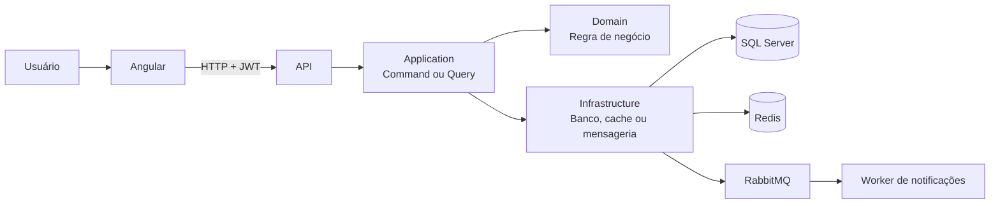
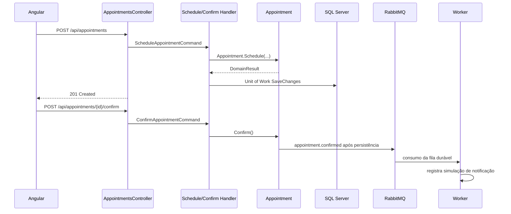

# Guia de estudo — como o ClinicHub funciona

Este guia foi feito para você aprender lendo e executando o projeto. A ideia não é decorar tecnologias: é seguir uma operação real de ponta a ponta e entender por que cada responsabilidade está em uma camada específica.

## 1. Mapa mental antes de abrir o código

O ClinicHub recebe uma ação do usuário no Angular, valida a intenção no backend, aplica regras de negócio, persiste dados e, quando necessário, publica eventos para processamento assíncrono.



Use este mapa como referência: nenhuma regra clínica deve depender diretamente de controller, banco de dados ou Angular.

## 2. Ordem recomendada de estudo

1. Suba a stack e navegue pela aplicação.
2. Leia o domínio para entender as regras sem detalhes técnicos.
3. Siga um command da API até o banco.
4. Siga uma query e observe cache e Dapper.
5. Confirme uma consulta e acompanhe o evento no RabbitMQ/worker.
6. Leia autenticação e confirmação de e-mail.
7. Explore o Angular e a comunicação HTTP.
8. Execute testes e pipeline.

Ao final de cada passo, altere uma regra simples, rode os testes e desfaça a alteração. Isso transforma a leitura em prática.

## 3. Executando e observando o ambiente

Na raiz do projeto:

```powershell
Copy-Item .env.example .env
docker compose up -d --build
docker compose ps
```

Abra os seguintes endereços:

| Ferramenta | Uso no aprendizado |
|---|---|
| http://localhost:4200 | Aplicação Angular |
| http://localhost:8082/swagger | Contratos HTTP e exemplos de payload |
| http://localhost:8081 | Logs estruturados no Seq |
| http://localhost:15672 | Filas e exchanges do RabbitMQ |

Entre no frontend com `admin@clinichub.local` / `Admin123!`. Essas credenciais existem somente para desenvolvimento.

## 4. Clean Architecture na prática

### Domain: o centro das regras

Comece em [Appointment.cs](../src/ClinicHub.Domain/Appointments/Appointment.cs), [Patient.cs](../src/ClinicHub.Domain/Patients/Patient.cs) e [Payment.cs](../src/ClinicHub.Domain/Payments/Payment.cs).

Aqui ficam os **agregados**: objetos que protegem sua própria consistência. Por exemplo, `Appointment` controla transições entre agendada, confirmada e cancelada. A confirmação inválida não lança exceção para controlar fluxo; ela retorna `DomainResult` com `DomainNotification`.

Os **value objects** ficam em [ValueObjects](../src/ClinicHub.Domain/ValueObjects). `EmailAddress`, `Money` e `AppointmentSlot` evitam que valores inválidos cheguem aos agregados. Eles não têm identidade: dois objetos `Money` com valor e moeda iguais representam o mesmo valor de negócio.

Pergunta de estudo: por que `AppointmentSlot` deve validar início, fim e duração antes de a consulta chegar ao banco?

### Application: os casos de uso

A camada Application recebe intenções do sistema. Um **Command** muda estado; uma **Query** apenas lê dados.

Exemplos:

- [ScheduleAppointmentCommandHandler.cs](../src/ClinicHub.Application/Appointments/Commands/ScheduleAppointment/ScheduleAppointmentCommandHandler.cs) cria uma consulta.
- [GetRevenueReportQueryHandler.cs](../src/ClinicHub.Application/Financial/Queries/GetRevenueReport/GetRevenueReportQueryHandler.cs) consulta receita.
- [RegisterAccountCommandHandler.cs](../src/ClinicHub.Application/Authentication/Commands/RegisterAccount/RegisterAccountCommandHandler.cs) cria uma conta pendente de confirmação.

O MediatR encontra o handler adequado. Antes dele, o pipeline executa FluentValidation; veja [ValidationBehavior.cs](../src/ClinicHub.Application/Common/Behaviors/ValidationBehavior.cs). Isso mantém validações de entrada fora do controller e evita duplicação.

### Infrastructure: detalhes substituíveis

A camada Infrastructure implementa contratos definidos pelo Domain/Application:

- [ClinicHubDbContext.cs](../src/ClinicHub.Infrastructure/Persistence/ClinicHubDbContext.cs) e configurações EF Core persistem agregados no SQL Server.
- [RedisPatientListCache.cs](../src/ClinicHub.Infrastructure/Caching/RedisPatientListCache.cs) armazena listagens de pacientes.
- [RabbitMqIntegrationEventPublisher.cs](../src/ClinicHub.Infrastructure/Messaging/RabbitMqIntegrationEventPublisher.cs) publica eventos.
- [DapperRevenueReportReader.cs](../src/ClinicHub.Infrastructure/Financial/DapperRevenueReportReader.cs) executa a leitura analítica de receita.

O ganho é poder trocar Redis, SMTP ou banco com impacto limitado: os casos de uso conhecem interfaces, não implementações concretas.

### API: a borda HTTP

O arquivo [Program.cs](../src/ClinicHub.API/Program.cs) é o **composition root**: registra dependências, autenticação, CORS, Serilog, Swagger e health checks. Controllers convertem HTTP em Commands/Queries. Compare [AppointmentsController.cs](../src/ClinicHub.API/Controllers/AppointmentsController.cs) com seu handler na Application.

## 5. Fluxo guiado: agendar e confirmar uma consulta

Este é o melhor fluxo para estudar DDD, CQRS, persistência e mensageria juntos.



Para experimentar:

1. Crie um paciente na tela **Pacientes**.
2. Em **Agendamentos**, selecione paciente e médico, com horário futuro.
3. Copie o ID retornado e confirme a consulta.
4. Abra o RabbitMQ e o Seq; procure a fila `clinichub.notifications.appointment-confirmed` e o log do worker.

Regra importante: o evento só é publicado depois de a consulta ser persistida. Isso evita notificar algo que não foi confirmado no banco.

## 6. Cache e leitura de relatório

### Redis para pacientes

`GET /api/patients` usa uma chave baseada em filtro, página, tamanho e versão. Alterações de paciente incrementam a versão depois do commit, tornando chaves antigas naturalmente obsoletas.

Experimento: faça duas buscas iguais, abra o Redis e observe as chaves. Em seguida altere o paciente e faça a mesma busca: uma nova versão será consultada.

### Dapper para financeiro

O relatório não precisa carregar agregados para mudar estado. Por isso [DapperRevenueReportReader.cs](../src/ClinicHub.Infrastructure/Financial/DapperRevenueReportReader.cs) usa SQL direto e retorna um DTO agregado por dia e moeda. Esta é uma forma prática de CQRS: modelo de leitura otimizado, separado do modelo de escrita.

## 7. Segurança e identidade

### Login e refresh token

O login cria access token JWT de curta duração e refresh token. Apenas o **hash** do refresh token é persistido. Ao renovar, o anterior é revogado e um novo token é emitido; isso é rotação.

Leia [LoginCommandHandler.cs](../src/ClinicHub.Application/Authentication/Commands/Login/LoginCommandHandler.cs) e [RefreshAccessTokenCommandHandler.cs](../src/ClinicHub.Application/Authentication/Commands/RefreshAccessToken/RefreshAccessTokenCommandHandler.cs).

No Angular, [auth.interceptor.ts](../frontend/clinichub-web/src/app/core/http/auth.interceptor.ts) adiciona o Bearer token e tenta renovar a sessão após um `401`. [auth.guard.ts](../frontend/clinichub-web/src/app/core/auth/auth.guard.ts) bloqueia rotas para usuários não autenticados.

### Cadastro e e-mail

`POST /api/auth/register` cria uma conta `Patient` inativa. Um token aleatório é enviado por e-mail e apenas seu hash fica no banco. `POST /api/auth/confirm-email` ativa a conta quando o token válido é apresentado.

No modo local, o link de confirmação aparece nos logs da API. Em produção, configure SMTP no `.env`. Leia [User.cs](../src/ClinicHub.Domain/Authentication/User.cs) e [EmailConfirmationSender.cs](../src/ClinicHub.Infrastructure/Authentication/EmailConfirmationSender.cs).

## 8. Frontend Angular

O frontend está em `frontend/clinichub-web/src/app` e usa componentes standalone, sem `NgModule`.

| Pasta | Responsabilidade |
|---|---|
| `core/auth` | Sessão, JWT e guard |
| `core/http` | Cliente HTTP e interceptor |
| `core/models` | Contratos TypeScript |
| `features` | Telas por domínio de negócio |
| `layout` | Shell com sidebar e toolbar |

As rotas em [app.routes.ts](../frontend/clinichub-web/src/app/app.routes.ts) são lazy. Isso significa que telas como financeiro e agenda são carregadas somente quando necessárias.

Exercício: abra DevTools > Network, entre com o Admin e observe o header `Authorization`. Depois altere o token no `localStorage` e observe a tentativa de refresh após a próxima requisição protegida.

## 9. Observabilidade

Cada requisição recebe ou preserva `X-Correlation-ID`. O middleware está em [CorrelationIdMiddleware.cs](../src/ClinicHub.API/Middleware/CorrelationIdMiddleware.cs). O ID aparece no log e na resposta, permitindo seguir uma operação entre cliente e API.

Os endpoints de saúde são:

- `/health/live`: processo está no ar.
- `/health/ready`: processo e dependências SQL Server, Redis e RabbitMQ estão prontas.

Exercício: envie um `X-Correlation-ID` próprio pelo Swagger e pesquise esse valor no Seq.

## 10. Testes e pipeline

Os testes ficam em `tests/` e são separados por responsabilidade:

- `ClinicHub.Domain.Tests`: regras e value objects.
- `ClinicHub.Application.Tests`: handlers e validators.
- `ClinicHub.Infrastructure.Tests`: repositórios EF Core.
- `ClinicHub.API.IntegrationTests`: endpoint de saúde com `WebApplicationFactory`.

Execute:

```powershell
dotnet test ClinicHub.sln --configuration Release --no-restore --collect "XPlat Code Coverage"

Set-Location frontend/clinichub-web
npm run lint
npm test -- --watch=false
```

O GitHub Actions reproduz essas verificações. Leia [ci.yml](../.github/workflows/ci.yml) e compare cada job com os comandos acima.

> Atenção: a aferição atual da auditoria encontrou 68,36% no Domain e 67,14% na Application. A meta de 70% precisa ser restaurada adicionando testes aos fluxos novos de cadastro e confirmação de e-mail.

## 11. Exercícios de evolução

Depois de compreender o fluxo existente, implemente um item de cada vez:

1. Escreva testes para `RegisterAccountCommandHandler` e `ConfirmEmailCommandHandler` até recuperar 70% de cobertura.
2. Adicione endpoint de reenvio de confirmação com limite de tentativas.
3. Crie uma DLQ no RabbitMQ e evite descartar mensagens que falham no worker.
4. Adicione guard de role no Angular, mantendo a API como fonte real de autorização.
5. Torne `apiUrl` configurável em runtime para viabilizar deploy.

Antes de cada exercício, escreva um teste que falha. Depois implemente o menor código que o faça passar. Esse ciclo é a forma mais eficiente de transformar este projeto em aprendizado duradouro.

## Referências internas

- [Arquitetura detalhada](arquitetura.md)
- [Modelo de domínio](modelo-do-dominio.md)
- [Guia de API](api-examples.md)
- [Operação local](operacao-local.md)
- [ADRs](adr)
- [Plano e roadmap](plano-de-execucao.md)
