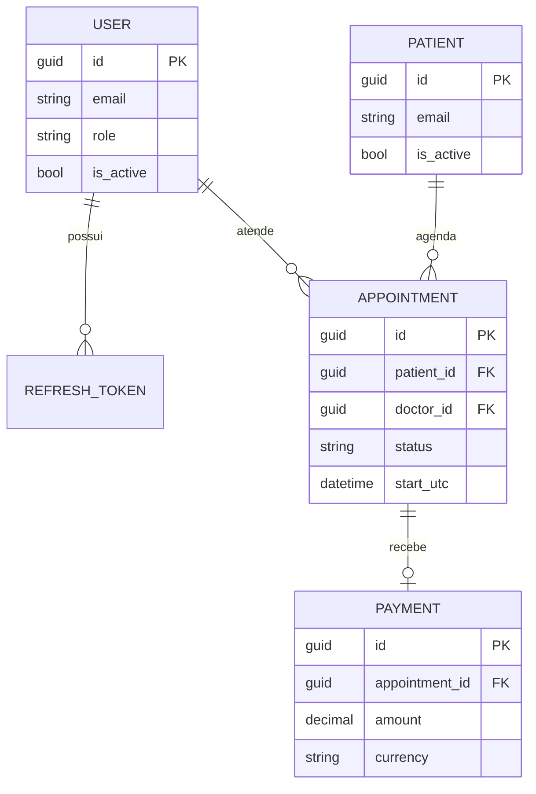

# Modelo de domínio

## Agregados

- `Patient`: representa a pessoa atendida e protege a consistência de seus dados cadastrais.
- `Appointment`: representa o ciclo de vida de uma consulta: agendada, confirmada ou cancelada.
- `Payment`: representa um pagamento efetivamente registrado para uma consulta.
- `User`: representa a identidade de acesso da plataforma. Usuários de equipe possuem os roles `Admin`, `Doctor` ou `Receptionist`; cadastros públicos recebem `Patient` e permanecem inativos até confirmar o e-mail.
- `RefreshToken`: representa uma sessão renovável. O token bruto nunca é persistido.

## Value objects

`PersonName`, `EmailAddress`, `PhoneNumber`, `AppointmentSlot` e `Money` validam e encapsulam valores sem identidade própria. Duas instâncias com os mesmos valores são equivalentes.

## Regras iniciais

- Datas e horários operacionais são obrigatoriamente UTC.
- Uma consulta só pode ser criada ou confirmada para um horário futuro.
- O intervalo da consulta tem entre 15 minutos e 8 horas; dois intervalos se sobrepõem quando o início de um ocorre antes do fim do outro e vice-versa.
- Uma confirmação gera `AppointmentConfirmedDomainEvent` no próprio agregado. A publicação externa será adicionada nas próximas camadas.
- Uma consulta só pode ser paga após confirmação; cada consulta aceita apenas um pagamento.
- A confirmação de e-mail exige token válido, não expirado e de uso único. O hash do token é armazenado por até 24 horas, e a conta só se torna ativa após a confirmação.
- Falhas de regras retornam `DomainResult` com `DomainNotification`; o domínio não usa exceções para fluxo esperado.

## Relações principais

