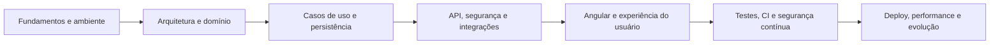

# Plano de ensino completo — ClinicHub

> **Objetivo:** usar o ClinicHub como laboratório para aprender arquitetura de software, .NET, Angular, qualidade, segurança e operação. O resultado de cada módulo deve ser uma evidência executável — teste, alteração pequena, relatório ou demonstração — e não apenas leitura.

## Como usar este plano

- **Ritmo sugerido:** 6 a 8 horas por semana durante 15 semanas. Se houver menos tempo, mantenha a ordem e aumente a duração de cada módulo.
- **Método:** para cada módulo, leia o material indicado, execute o sistema, siga um fluxo no código, faça o exercício e só então avance.
- **Regra de segurança:** use apenas os dados sintéticos e credenciais de desenvolvimento do repositório. Nunca adicione dados clínicos reais, senhas ou chaves ao Git.
- **Registro:** mantenha um diário curto com: hipótese, comando executado, resultado, erro encontrado e decisão tomada. Esse hábito transforma o projeto em portfólio e aprendizado.

## Visão da trilha

## Semana 0 — Preparação e mapa do produto

**Aprenda:** o problema de negócio, os limites do MVP e como a solução é organizada.

- Leia [README](../README.md), [arquitetura](arquitetura.md), [modelo do domínio](modelo-do-dominio.md) e [plano de execução](plano-de-execucao.md).
- Localize as pastas `src`, `frontend`, `tests`, `docs` e `.github`.
- Identifique os papéis do administrador, médico, recepcionista e paciente.

**Prática:** desenhe, sem consultar o diagrama, o caminho "usuário agenda consulta → banco → evento → worker". Depois compare com o diagrama da arquitetura.

**Evidência de conclusão:** explique em cinco minutos por que o frontend não acessa SQL Server ou RabbitMQ diretamente.

## Semana 1 — Ambiente local, Git e Docker Compose

**Aprenda:** variáveis de ambiente, containers, dependências locais e diagnóstico básico.

- Siga [operação local](operacao-local.md).
- Execute `docker compose up -d --build`, `docker compose ps` e `docker compose logs api`.
- Abra Angular, Swagger, Seq e RabbitMQ; os endereços estão no [guia de estudo](guia-de-estudo.md#3-executando-e-observando-o-ambiente).
- Leia `.env.example`, `docker-compose.yml`, `.dockerignore` e os Dockerfiles.

**Prática:** pare apenas o Redis, observe `/health/ready`, reinicie o serviço e explique a diferença entre liveness e readiness.

**Evidência de conclusão:** capture o estado saudável de todos os containers e documente qual dependência torna a API "not ready".

## Semana 2 — Clean Architecture e composição da aplicação

**Aprenda:** direção de dependências, composition root e separação entre regra e detalhe técnico.

- Leia os projetos `ClinicHub.Domain`, `ClinicHub.Application`, `ClinicHub.Infrastructure` e `ClinicHub.API` nesta ordem.
- Estude [Program.cs](../src/ClinicHub.API/Program.cs) como composition root.
- Consulte os ADRs em [docs/adr](adr) para entender decisões já tomadas.

**Prática:** escolha um contrato da Application, encontre sua implementação na Infrastructure e trace onde ela é registrada na injeção de dependência.

**Evidência de conclusão:** produza uma tabela com "camada → responsabilidade → exemplos de tipos → dependências permitidas".

## Semana 3 — DDD tático e regras de domínio

**Aprenda:** agregados, entidades, value objects, invariantes, notificações e domain events.

- Leia [Appointment.cs](../src/ClinicHub.Domain/Appointments/Appointment.cs), [Patient.cs](../src/ClinicHub.Domain/Patients/Patient.cs), [Payment.cs](../src/ClinicHub.Domain/Payments/Payment.cs) e os tipos em `Domain/ValueObjects`.
- Estude os testes em `tests/ClinicHub.Domain.Tests` antes de alterar regras.

**Prática:** adicione primeiro um teste de borda para uma regra já existente (por exemplo, horário inválido ou transição de consulta inválida), depois implemente a menor mudança necessária.

**Evidência de conclusão:** teste no padrão AAA, com nome que descreva cenário e resultado; explique por que a regra pertence ao agregado e não ao controller.

## Semana 4 — CQRS, MediatR e validação de entrada

**Aprenda:** diferença entre Command e Query, handlers, DTOs, FluentValidation e pipeline behaviors.

- Compare [ScheduleAppointmentCommandHandler.cs](../src/ClinicHub.Application/Appointments/Commands/ScheduleAppointment/ScheduleAppointmentCommandHandler.cs) com [GetRevenueReportQueryHandler.cs](../src/ClinicHub.Application/Financial/Queries/GetRevenueReport/GetRevenueReportQueryHandler.cs).
- Leia [ValidationBehavior.cs](../src/ClinicHub.Application/Common/Behaviors/ValidationBehavior.cs).
- Estude os mocks em `tests/ClinicHub.Application.Tests`.

**Prática:** crie uma validação adicional para um command existente e cubra entrada inválida e sucesso.

**Evidência de conclusão:** demonstre que o controller permanece fino e que a validação acontece antes do handler.

## Semana 5 — Persistência, EF Core e migrations

**Aprenda:** DbContext, mapeamentos, repositórios, Unit of Work, migrations e consultas de leitura.

- Leia [ClinicHubDbContext.cs](../src/ClinicHub.Infrastructure/Persistence/ClinicHubDbContext.cs) e uma configuração em `Persistence/Configurations`.
- Leia uma migration já confirmada; não modifique migrations existentes sem um objetivo claro.
- Compare EF Core para escrita com [DapperRevenueReportReader.cs](../src/ClinicHub.Infrastructure/Financial/DapperRevenueReportReader.cs) para relatório.

**Prática:** modele uma coluna simples em uma entidade de laboratório, gere uma migration nova, aplique-a localmente e escreva teste de persistência. Descarte a experiência ou entregue-a em branch própria.

**Evidência de conclusão:** explique por que relatório financeiro não precisa carregar o agregado completo para alterar estado.

## Semana 6 — API REST, autenticação e autorização

**Aprenda:** controllers, contratos HTTP, JWT, refresh-token rotation, roles, policies e CORS.

- Explore os exemplos de [API](api-examples.md) no Swagger.
- Leia os handlers de login, refresh e confirmação em `Application/Authentication`.
- Compare o controller com o handler correspondente e examine as policies registradas em `Program.cs`.

**Prática:** faça login no Swagger, envie uma requisição autenticada, renove a sessão e tente acessar uma rota sem role suficiente.

**Evidência de conclusão:** descreva onde cada responsabilidade fica: autenticação, autorização, regra de negócio e resposta HTTP.

## Semana 7 — Cache, mensageria e processamento assíncrono

**Aprenda:** cache-aside com Redis, invalidação por versão, eventos de integração e consumidor RabbitMQ.

- Leia [RedisPatientListCache.cs](../src/ClinicHub.Infrastructure/Caching/RedisPatientListCache.cs).
- Leia [RabbitMqIntegrationEventPublisher.cs](../src/ClinicHub.Infrastructure/Messaging/RabbitMqIntegrationEventPublisher.cs) e o projeto `ClinicHub.Notifications.Worker`.
- Use Seq e a interface do RabbitMQ para observar o fluxo.

**Prática:** liste pacientes duas vezes para observar cache; depois altere um paciente e verifique a invalidação. Confirme uma consulta e acompanhe a mensagem até o worker.

**Evidência de conclusão:** explique por que publicação após persistência é necessária e quais riscos ainda existem sem outbox, retry e DLQ.

## Semana 8 — Frontend Angular standalone

**Aprenda:** componentes standalone, rotas lazy, Reactive Forms, serviços HTTP, interceptor e guard.

- Explore `frontend/clinichub-web/src/app` seguindo a estrutura descrita no [guia de estudo](guia-de-estudo.md#8-frontend-angular).
- Leia `core/auth`, `core/http`, `features` e `app.routes.ts`.
- Use DevTools para observar `Authorization`, respostas `401` e carregamento lazy.

**Prática:** adicione uma validação visual ou uma mensagem de erro de formulário, com teste correspondente quando aplicável.

**Evidência de conclusão:** explique por que o guard melhora experiência, mas a API ainda é a fonte verdadeira de autorização.

## Semana 9 — Estratégia de testes e cobertura

**Aprenda:** AAA, FIRST, mocks, testes unitários, integração, cobertura e limites de testes.

- Execute os comandos da seção [Testes e pipeline](guia-de-estudo.md#10-testes-e-pipeline).
- Leia um teste por camada em `tests/`.
- Leia `scripts/Verify-Coverage.ps1` e observe o gate de 70% em Domain/Application.

**Prática:** escreva um caso de borda que falhe antes da mudança e passe depois. Rode o gate com limite propositalmente acima da cobertura atual para observar a falha controlada.

**Evidência de conclusão:** indique quando usar mock, teste de integração e teste end-to-end; não busque cobertura artificial.

## Semana 10 — Observabilidade e diagnóstico

**Aprenda:** logs estruturados, Serilog, Correlation ID, health checks e sinais operacionais.

- Leia [CorrelationIdMiddleware.cs](../src/ClinicHub.API/Middleware/CorrelationIdMiddleware.cs) e os health checks em `Program.cs`.
- Use Seq para correlacionar uma chamada do Swagger.
- Leia a seção de observabilidade no [guia de estudo](guia-de-estudo.md#9-observabilidade).

**Prática:** envie um `X-Correlation-ID` próprio, provoque uma resposta de validação e encontre toda a sequência no Seq.

**Evidência de conclusão:** apresente um diagnóstico de incidente fictício usando somente logs, health checks e fila.

## Semana 11 — Segurança, privacidade e dados sensíveis

**Aprenda:** rate limiting, headers, HTTPS/HSTS, configuração Production, auditoria, ownership, minimização, masking e criptografia planejada.

- Leia [auditoria e autorização](auditoria-e-autorizacao.md), [proteção de dados](protecao-de-dados.md) e [hardening de deploy](hardening-deploy.md).
- Inspecione `SecurityHeadersMiddleware`, `AuditTrailMiddleware` e `ProductionConfigurationValidator`.
- Revise a diferença entre registro de auditoria útil e log que expõe PII ou token.

**Prática:** valide o retorno `429` nas rotas limitadas e tente consultar o perfil de paciente com uma conta diferente.

**Evidência de conclusão:** liste quais dados não podem ir para log, cache compartilhado, artefato de CI ou repositório.

## Semana 12 — CI/CD, SAST, DAST e atualização de dependências

**Aprenda:** GitHub Actions, artefatos TRX/Cobertura, auditoria NPM/NuGet, CodeQL, Dependabot e OWASP ZAP.

- Leia `.github/workflows/ci.yml`, `codeql.yml` e `dast.yml`.
- Consulte a [trilha de qualidade](plano-de-execucao.md#trilha-de-qualidade-e-platform-engineering) e o [guia de hardening](hardening-deploy.md).
- Observe as execuções aprovadas no GitHub Actions e os artefatos gerados.

**Prática:** abra um pull request de exercício, faça uma alteração que viole formatação ou teste e acompanhe o check falhar. Corrija e veja o check voltar a verde.

**Evidência de conclusão:** diferencie SAST, auditoria de dependência e DAST; explique em que ponto cada um encontra um tipo de risco.

## Semana 13 — Containers, deploy e AWS como laboratório

**Aprenda:** usuário não-root, redes internas, secrets externos, TLS no proxy, manifestos separados e limites entre desenvolvimento e produção.

- Compare `docker-compose.yml` com `docker-compose.production.yml`.
- Leia `.env.production.example` e [AWS para aprendizado gratuito](aws-aprendizado-gratuito.md).
- Verifique o usuário da imagem com `docker image inspect <imagem> --format '{{.Config.User}}'`.

**Prática:** valide sintaxe do manifesto de produção sem inserir segredo real: `docker compose --env-file .env.production.example -f docker-compose.production.yml config --quiet`.

**Evidência de conclusão:** desenhe a topologia com proxy/ingress, API, worker, banco, Redis, RabbitMQ e secret manager. Identifique quais portas nunca devem ficar públicas.

## Semana 14 — Performance, resiliência e governança

**Aprenda:** SLO, carga, p95/p99, gargalos, branch protection, revisão e quality gates.

- Leia [capacidade e performance](capacidade-e-performance.md).
- Revise as etapas pendentes 17, 18 e 22 no [plano de execução](plano-de-execucao.md).
- Planeje a DLQ, retry, idempotência e outbox como evolução de mensageria.

**Prática:** escreva um cenário k6 para listagem de pacientes com cache frio e quente. Não declare capacidade sem medir métricas no ambiente descrito.

**Evidência de conclusão:** defina um SLO inicial e uma regra de merge que impeça regressão de qualidade.

## Semana 15 — Projeto de consolidação

Escolha uma evolução pequena, implemente-a do domínio ao frontend e trate-a como entrega profissional. Sugestões:

1. Reenvio de confirmação de e-mail com rate limit e SMTP de teste.
2. Portal do paciente para cancelar ou reagendar a própria consulta, com ownership testado.
3. Guard de role no Angular, preservando autorização definitiva na API.
4. DLQ e retry limitado para notificações.
5. Um cenário de carga reproduzível com relatório de métricas.

**Checklist de entrega:** ADR curto quando houver decisão relevante; testes de sucesso/erro/borda; documentação; CI verde; nenhuma chave ou dado real; demonstração gravada ou GIF no README.

## Etapas pendentes do projeto e ordem recomendada

| Prioridade | Etapa | Por que vem agora | Resultado esperado |
|---:|---|---|---|
| 1 | 17 — SonarQube/SonarCloud | Complementa CodeQL com Quality Gate para código novo. | Bugs, vulnerabilidades, duplicação e cobertura de código novo analisados no PR. |
| 2 | 18 — Governança de PR | Sem branch protection, os checks podem ser ignorados. | `main` exige revisão e checks obrigatórios. |
| 3 | 22 — Capacidade e performance | O sistema não deve prometer escala sem números. | k6, SLOs, métricas e capacidade declarada em cenário reproduzível. |
| 4 | Resiliência de eventos | Protege integrações assíncronas antes de uso real. | Outbox, retry, DLQ e idempotência. |
| 5 | Produção real | O hardening existe, mas ainda não há ambiente público operado. | IaC, registry, deploy, backups/restores, alertas e SMTP real. |

## Quando considerar o ClinicHub pronto para demonstração profissional

O MVP atual é completo para estudo e portfólio. Para dizer que está pronto para uso público com dados clínicos, ainda são necessários, no mínimo: quality gate e proteção de PR, medição de carga, operação real em cloud, backups e restauração testados, monitoramento/alertas, resiliência de mensageria, revisão LGPD/jurídica, gestão operacional de segredos e testes end-to-end autenticados. Isso não diminui o projeto: deixa explícita a diferença saudável entre **MVP de aprendizado sólido** e **produto clínico em produção**.
