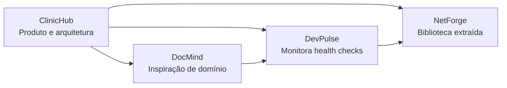
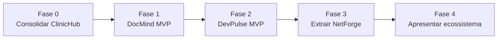

# Plano do Ecossistema de Portfólio

> **Objetivo:** construir um portfólio coerente de projetos independentes que, juntos, demonstrem arquitetura corporativa, IA aplicada, sistemas em tempo real e contribuição open source.

## Visão e princípio de execução

O ecossistema será composto por quatro repositórios, mas cada projeto deve ser útil e demonstrável sozinho. As integrações serão adicionadas somente quando os projetos envolvidos estiverem estáveis; nenhum projeto fica bloqueado pela existência de outro.

| Projeto | Papel no portfólio | Resultado demonstrável |
|---|---|---|
| ClinicHub | Carro-chefe .NET/full stack | Gestão clínica com arquitetura, segurança, integrações e operação local. |
| DocMind | IA aplicada em Python | Upload, extração estruturada, validação e revisão humana de documentos. |
| DevPulse | Operação e real-time | Painel que monitora APIs e exibe incidentes e métricas ao vivo. |
| NetForge | Open source e reuso | Biblioteca NuGet pequena, estável e usada pelos projetos que a motivaram. |

## Regras de qualidade

Estas regras são obrigatórias para todo projeto do ecossistema:

1. Repositório executável do zero com instruções claras e `docker compose up` quando houver infraestrutura.
2. README com problema, arquitetura, decisões técnicas, captura de tela/GIF e comandos de validação.
3. CI executando formatação/lint, build e testes em cada pull request e push.
4. Dados de demonstração sintéticos ou anonimizados; nenhum dado real de paciente, documento médico ou credencial vai para o Git.
5. Dependências atualizadas, secrets fora do versionamento e checklist de segurança antes de qualquer publicação.
6. Um MVP fechado antes de iniciar funcionalidades de segunda geração ou integrações entre repositórios.

## Fase 0 — Consolidar ClinicHub

**Objetivo:** tornar o carro-chefe uma referência confiável antes de ampliar o portfólio.

| Item | Entregável | Critério de conclusão |
|---|---|---|
| Cobertura e regressão | Testes para cadastro/confirmação de e-mail e meta mínima restaurada | Domain e Application com cobertura mínima de 70% verificada pela CI. |
| Segurança de produção | Secrets externos, HTTPS/HSTS, rate limiting e política de sessão revisada | Não há chaves reais no repositório; rotas sensíveis possuem limitação e testes. |
| Auditoria | Registro de alterações sensíveis | Alterações de paciente, consulta, pagamento e roles possuem ator, data e Correlation ID. |
| Resiliência de eventos | Retry, DLQ, idempotência e outbox | Mensagens falhas são recuperáveis e não são perdidas silenciosamente. |
| Atualização de plataforma | Plano e execução de migração para .NET 10 LTS | Build, testes e Compose aprovados na plataforma suportada. |
| Demonstração | Vídeo curto/GIF e README revisado | Um recrutador consegue executar e entender o valor em poucos minutos. |

**Saída da fase:** ClinicHub publicamente demonstrável, com os riscos P1 da [avaliação de maturidade](avaliacao-de-maturidade.md) tratados ou explicitamente registrados.

## Fase 1 — DocMind

**Objetivo:** demonstrar Python, processamento assíncrono e IA aplicada a documentos administrativos de saúde, sem usar dados reais.

### Escopo do MVP

- API FastAPI com upload de PDF e persistência de metadados no PostgreSQL.
- Armazenamento privado de arquivo em volume local/MinIO, com hash e status de processamento.
- Worker assíncrono (Celery ou RQ com Redis) para extração; tarefas pesadas não devem ficar no ciclo da requisição HTTP.
- Extração em JSON validado por schema: tipo de documento, emissor, paciente, CPF/CNPJ, data, total e itens.
- OCR para PDFs escaneados e leitor de texto para PDFs nativos.
- Tela/API de revisão humana, correção e aprovação do resultado.
- Filtros, consulta por documento e resumo de processamento.

### Decisões obrigatórias

| Tema | Decisão esperada |
|---|---|
| IA | Porta/adaptador para provedor; modelo, versão do prompt, custo e tempo devem ficar registrados. |
| Confiança | Combinar validação determinística e sinais de extração; não confiar apenas na autoavaliação do modelo. |
| Privacidade | Fixtures sintéticas/anonimizadas, retenção definida, controle de acesso e não envio indevido de dados sensíveis ao provedor. |
| Falhas | Retry limitado, fila de falhas e possibilidade de reprocessar um documento. |
| Avaliação | Dataset de teste versionado e métricas de acurácia por campo, não apenas exemplos manuais. |

### Critérios de conclusão

- Upload → fila → extração → revisão → consulta demonstrado em vídeo/GIF.
- Testes unitários, de API e de processamento com provedores de IA simulados.
- Docker Compose, Swagger, README e diagrama de fluxo completos.
- Nenhum documento ou dado pessoal real no repositório.

## Fase 2 — DevPulse

**Objetivo:** demonstrar comunicação em tempo real e raciocínio operacional monitorando o ClinicHub e o DocMind.

### Escopo do MVP

- CRUD de serviços monitorados, com URL de health check, intervalo e timeout.
- Worker com concorrência limitada para executar verificações e armazenar latência, código HTTP e disponibilidade.
- SignalR para publicar atualizações ao Angular.
- Dashboard com status atual, latência, uptime de 24 horas e histórico de incidentes.
- Filtros por serviço/período e exportação de relatório simples.
- Cadastro inicial contendo os endpoints de health do ClinicHub e do DocMind, sem dependência obrigatória deles.

### Controles essenciais

- Validar URLs e bloquear destinos privados/metadata endpoints para evitar SSRF.
- Aplicar timeout, limite de concorrência, retry controlado e deduplicação de alertas.
- Instrumentar o próprio DevPulse com health checks e logs correlacionados.
- Deixar documentado que escala horizontal de SignalR requer backplane/serviço gerenciado.

### Critérios de conclusão

- Demonstração de queda e recuperação de serviço refletida ao vivo no painel.
- Testes de worker, Hub, regras de URL e endpoints.
- Docker Compose, README, GIF e CI aprovados.

## Fase 3 — NetForge

**Objetivo:** publicar uma biblioteca .NET pequena e útil, extraída de necessidades comprovadas nos projetos anteriores.

### Processo de seleção

Não iniciar pela lista de funcionalidades. Primeiro identificar código repetido e estável em ClinicHub/DevPulse. A biblioteca deve resolver **um problema bem delimitado**. Candidatos:

- Conversão consistente de `Result` para `ProblemDetails`.
- Paginação para `IQueryable` com metadados e validações.
- Utilitários de idempotência para APIs .NET.

Itens genéricos sem diferencial — como um wrapper obrigatório de resposta — não entram no escopo inicial.

### Critérios de conclusão

- API pública pequena, documentação XML e exemplos copiados e executáveis no README.
- Cobertura acima de 90%, análise de compatibilidade e versionamento SemVer.
- Licença MIT, changelog, badges e publicação automatizada no NuGet após tag de versão.
- Uso real por pelo menos ClinicHub ou DevPulse antes de divulgar o pacote.

## Fase 4 — Integração e apresentação do portfólio

**Objetivo:** contar uma história clara sem criar acoplamento artificial.

| Ação | Resultado |
|---|---|
| Organização | Repositórios consistentes, tópicos GitHub e perfil/organização com links entre os projetos. |
| Integração leve | DevPulse monitora health checks públicos dos outros projetos; não compartilha banco ou código de domínio. |
| Evidência visual | GIF ou vídeo curto em cada README, com dados de demonstração reproduzíveis. |
| Narrativa | Post ou página de portfólio explicando problema, decisão difícil, trade-off e resultado de cada projeto. |
| Demonstração | Ambientes publicados quando houver orçamento e segurança adequados; caso contrário, vídeo e Compose local são suficientes. |

Antes de qualquer publicação, siga o [guia AWS de aprendizado gratuito e seguro](aws-aprendizado-gratuito.md). Ele trata IAM, MFA, orçamento, Free Tier, laboratórios efêmeros e o limite entre experimentar na nuvem e operar um sistema com dados sensíveis.

## Sequência sugerida

| Marco | Só avançar quando... |
|---|---|
| ClinicHub → DocMind | riscos de segurança/testes prioritários estiverem resolvidos ou declarados com transparência. |
| DocMind → DevPulse | o fluxo de documento funcionar com dados sintéticos, fila e revisão humana. |
| DevPulse → NetForge | existir código realmente repetido e estável a extrair. |
| NetForge → apresentação | todos os READMEs, CI e demos estiverem funcionando. |

## Registro de andamento

| Fase | Status | Próxima confirmação |
|---|---|---|
| 0 — Consolidar ClinicHub | 🟨 Em andamento | Definir e executar a primeira evolução P1. |
| 1 — DocMind | ⬜ Pendente | Criar repositório e documento de arquitetura/MVP. |
| 2 — DevPulse | ⬜ Pendente | Criar repositório após o DocMind demonstrável. |
| 3 — NetForge | ⬜ Pendente | Selecionar problema validado para extração. |
| 4 — Integração e apresentação | ⬜ Pendente | Preparar a narrativa após os MVPs. |

## Próximo passo imediato

Concluir o primeiro item da Fase 0 no ClinicHub: testes e cobertura dos fluxos de cadastro e confirmação de e-mail. Ele reduz uma lacuna já conhecida, fortalece o projeto principal e cria o padrão de qualidade para os próximos repositórios.
